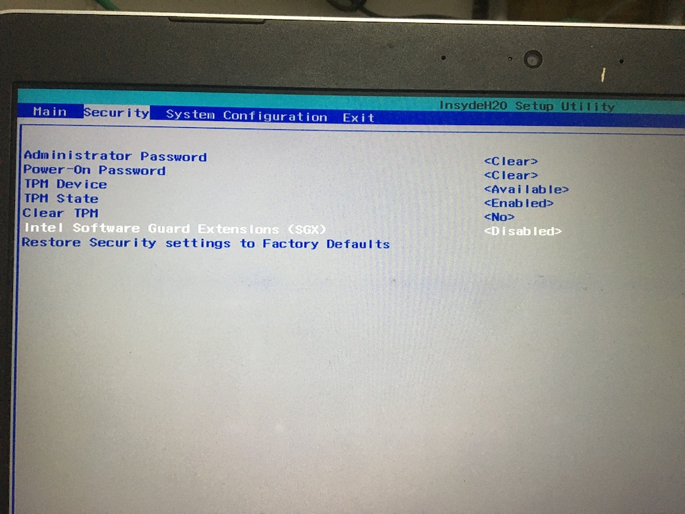
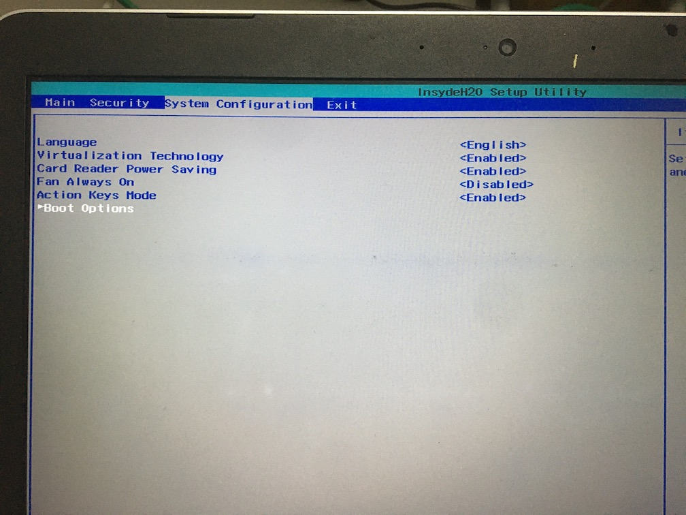
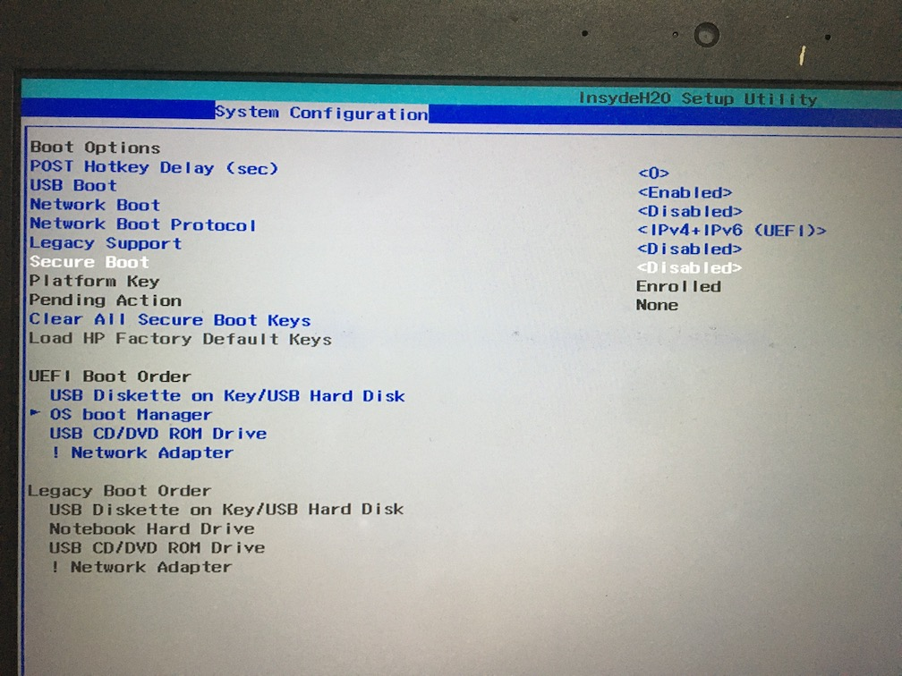

# HP Pavillion bc015tx Hackintosh

| Part       | Info                                                         |
| ---------- | ------------------------------------------------------------ |
| Model      | HP Pavillion bc015tx                                         |
| CPU        | Intel Core i7-6700HQ                                         |
| Mem        | Hynix 8GB DDR4 2400 MHz                                      |
| SSD        | SAMSUNG MZNTY128HDHP-000H1 128GB                             |
| HDD        | HGST HTS721010A9E630 1TB                                     |
| IGPU       | Intel HD Graphics 530                                        |
| DGPU       | Nvidia GTX960M                                               |
| Sound Card | Realtek ALC295 (Layout ID = 28 or 77)                        |
| WIFI / BT  | <ul><li>Original: Intel AC7265</li><li>Replacement: DELL DW1820A (Pci14e4,43a3)</li></ul> |
| Ethernet   | RTL8111/8168/8411 PCI Express Gigabit Ethernet Controller    |


## Usage

1. Download latest EFI in [Release ](https://github.com/the-eric-kwok/HP-Pavillion-bc015tx-Hackintosh/releases/latest)

2. If you are under Windows:

   1. Write installer to your flash disk via TransMac or Etcher. **This will erase all data from your flash disk**
   2. Mount EFI partition of your flash disk with Disk Genius, and replace the original EFI with downloaded one.
   3. Rename config-install.plist to config.plist
   4. Reboot and press F9 to select boot from flash disk
   5. Install

3. If you are under macOS:

   1. Search macOS in AppStore and download it. Assuming we're downloading macOS 10.15

   2. Insert your USB flash disk

   3. Open Terminal.app

   4. Open Finder, find `Install macOS Catalina.app` under `Applications`

   5. Drag and drop this app to terminal. It will be convert to a string of path, such as `/Applications/Install\ macOS\ Catalina.app`. Note that if there is a space behind `.app`, delete that space.

   6. then input `/Contents/Resources/createinstallmedia --volume`. Note that there is double-slash in front of `volume`, and a space behind it.

   7. Goto desktop, drag and drop the USB flash icon to terminal

   8. Finally we got a command, such as

      ```
      /Applications/Install\ macOS\ Catalina.app/Contents/Resources/createinstallmedia --volume /Volumes/FlashDisk
      ```

      and hit return. The createinstallmedia tool will write the installer to your USB flash. **This will erase all data from your flash disk**

   9. Mount EFI partition of USB flash with OpenCore Configurator, and put the EFI folder into it.

   10. Goto EFI folder inside EFI partition and rename config-install.plist to config.plist

   11. Eject flash disk and insert it to your target machine. Boot with key F9 pressed and select boot from USB flash disk.

4. After installation, boot into macOS, install OpenCore Configurator and mount both system EFI partition and EFI partition of your USB flash.

5. Goto EFI folder under <u>EFI partition of your USB flash</u>. Then copy BOOT and OC folder to EFI folder under <u>system EFI partition</u>. Note that on this step, do not replace entire EFI folder because there might be a Microsoft boot loader in your original EFI. Delete that means you cannot boot into Windows anymore.

6. Goto OC folder and delete config.plist. Then chose config file according to your Wi-Fi card and system version. For example I'm using Intel Wireless 7265 AC and macOS 10.15, I rename `config-Intel7265AC-Catalina.plist` to `config.plist`

7. Eject USB flash and reboot into macOS


#### What if my machine refuse to boot

Submit an [issue](https://github.com/the-eric-kwok/HP-Pavillion-bc015tx-Hackintosh/issues/new), attach the screenshot of where you stuck, which version of macOS are you using, which version of EFI are you using, etc. 


## Not Working

1. Nvidia DGPU
2. HDMI output


## Working

1. Intel iGPU
2. Sound
3. USB
4. Ethernet
5. Wi-Fi (Works perfectly after replace with 1820A, Sidecar, Handoff, Airdrop is working as well. If you are using the original card, you can consider about [itlwm](https://github.com/OpenIntelWireless/itlwm) with [HeliPort](https://github.com/OpenIntelWireless/HeliPort), but the package loss is a pain in the ass. )
6. Bluetooth (Original card use [IntelBluetoothFirmware](https://github.com/OpenIntelWireless/IntelBluetoothFirmware)）
7. Battery percentage（SSDT-BatteryFix.dsl）
8. Trackpad
9. Sleep
10. CPU power management
11. Brightness keys (BrightnessKey.kext)
12. Media keys
13. Card reader (by Sinetek-rtsx.kext)
14. Switch between left Windows (now is ⌘) and Alt (now is ⌥ ). Right Alt remains as ⌘, so the `⌘Del` is more convincing (by SSDT-SwapCmdOpt.dsl)


## About 1820A

Without replacement of 1820A you **DONT NEED** these kexts:

- BrcmBluetoothInjector.kext
- BrcmFirmwareData.kext
- BrcmPatchRAM3.kext
- AirportBrcmFixup.kext


## BIOS Settings

Press F10 at boot time to enter BIOS, disable Intel SGX and Secure Boot.








## ⚠️Warning⚠️

Don't download kext inside kexts folder, you should download the latest version of them instead. 

You should compile the dsl file under SSDT before putting them to ACPI, using iASL or MaciASL or AIDA64 Enginear.

```
# in the terminal
iasl SSDT-xxx.dsl

# Windows will be like this
# C:\User\Someone\Downloads\iasl.exe SSDT=xxx.dsl
```

Update:

Added SSDT-aml. If you are not familiar with compile or you can't do that compile thing you could add some patch from SSDT-aml. **But you should hotpatch original DSDT according comments in the dsl !**


Needed SSDT：

- SSDT-EC-USBX
- SSDT-NDGP_OFF
- SSDT-PLUG-_PR.CPU0
- SSDT-PNLF-SKL_KBL
- SSDT-SBUS
- ~~SSDT-ALS0~~ Merged into SSDT-AddDev

Check [OC-Little](https://github.com/daliansky/OC-little/) for more patching guide


**BTW, SSDT-BATT and SSDT-Battery has the same function, they both patch for the battery percentage. Use ONE of them only.**

**Set `csr-active-config` under OC-config.plist - NVRAM to `00000000` if you are fresh installing.**

## Links

[OpenCorePkg](https://github.com/acidanthera/OpenCorePkg/releases)

[Clover](https://github.com/CloverHackyColor/CloverBootloader/releases)

[OC-Little](https://github.com/daliansky/OC-little/)


## Catalog

[About 1820A](About_1820A.md)

[About Intel AC7265](About_Intel_AC7265.md)

[Patching USB with Hackintool](Patching_USB_with_Hackintool.md)

[Fixing Suddenly Poweroff On BIOS Stage](Fixing_Suddenly_Poweroff_On_BIOS_Stage.md)

